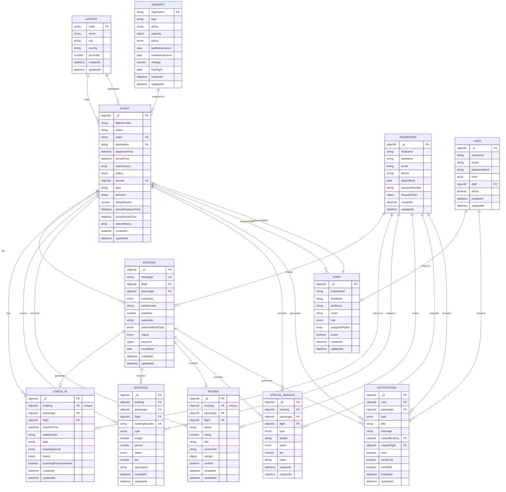

# Database Schema Diagram - Airline DBMS

## Mermaid ERD

This diagram can be rendered using Mermaid-compatible viewers (GitHub, GitLab, VS Code with Mermaid extension, mermaid.live).



---

## Relationship Legend

### One-to-One (1:1)
- **CHECK_IN ↔ BOOKING**: One check-in per booking (Unique constraint)
- **REVIEW ↔ BOOKING**: One review per booking (Unique constraint)
- **USER ↔ STAFF**: Optional link (User may have staff record)

### One-to-Many (1:N)
- **AIRPORT → FLIGHT**: Origin/Destination references
- **AIRCRAFT → FLIGHT**: Aircraft assignment
- **PASSENGER → All transaction entities**: Multiple bookings, check-ins, baggage, etc.
- **USER → NOTIFICATION**: User notifications
- **FLIGHT → All dependent entities**: Bookings, check-ins, baggage, reviews, services
- **STAFF ↔ FLIGHT**: Many-to-many via array

### Cardinality Symbols
- `||--o{` = One to Many (0 or more)
- `||--||` = One to One
- `o{--o{` = Many to Many

---

## Key Design Patterns

### 1. String References vs ObjectId References
- **Airport codes**: String reference (origin, destination in Flight)
- **Other entities**: ObjectId reference for joins and population

### 2. Embedded Documents
- `payment{}` in Booking: Payment details
- `capacity{}` in Aircraft: Seat breakdown
- `frequentFlyer{}` in Passenger: Loyalty info
- `ratings{}` in Review: Detailed ratings
- `seatClasses[]` in Flight: Class configuration
- `statusHistory[]` in Flight: Status log

### 3. Many-to-Many Implementation
- **Flight ↔ Staff**: Implemented via `assignedFlights[]` array in Staff entity
- Alternative could be junction table

### 4. Auto-Generated Identifiers
- `bookingId`: Format "BKG-{12-char-hex}"
- `trackingNumber`: Format "BG-{8-char-random}"
- Generated via pre-save hooks in Mongoose

### 5. Index Strategy
- Compound indexes for common queries
- Indexes on foreign keys for joins
- Status-based indexes for filtering
- Date-based indexes for time-series queries

---

## Sample Data Flow

### Booking Flow
```
1. Passenger searches Flights
2. Selects Flight → Creates Booking
3. Booking confirms seat reservation
4. Passenger checks in (24h before flight)
5. CheckIn generates boarding pass
6. Baggage registered with tracking
7. Notification sent at each step
8. After flight, Review can be submitted
```

### Entity Dependencies
```
Flight (needs: Airport, Aircraft)
  ↓
Booking (needs: Flight, Passenger)
  ↓
CheckIn (needs: Booking, Passenger, Flight)
  ↓
Baggage, SpecialService (depend on Booking)
  ↓
Review (created after Flight)
  ↓
Notification (throughout process)
```

---

## Deployment Notes

This schema is designed for:
- **MongoDB** (NoSQL document database)
- **Mongoose ODM** (MongoDB object modeling)
- **Node.js/Express** backend
- **React** frontend

All relationships use MongoDB referencing (not embedding) for flexibility and normalization while maintaining the benefits of document storage for complex nested data (like arrays and objects).

